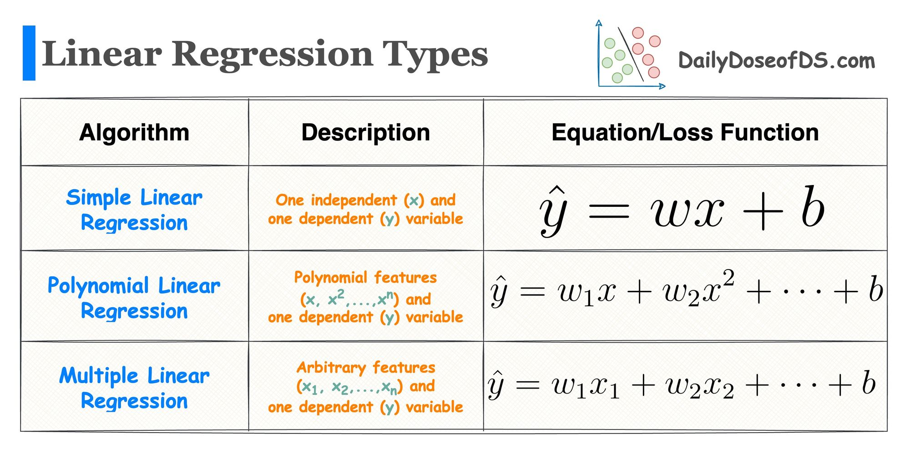
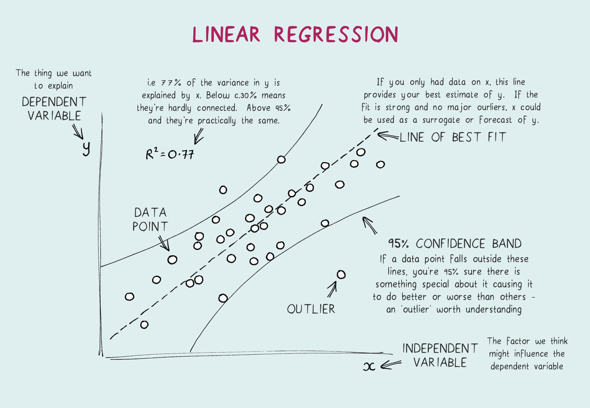

# Module 1: Linear Regression

## 1. What is Linear Regression?

Linear Regression is a **supervised learning** algorithm used to predict a continuous value, like a price or temperature. It works by finding the best-fitting straight line that describes the relationship between a set of input features and the output.

## 2. Types of Linear Regression

There are three common types of linear regression, each suited for different scenarios.

#### a. Simple Linear Regression
This is the most basic form. It uses a **single input feature** to predict the output.
-   **Key Formula:** `Y = b0 + b1*X`
-   **Use Case:** Use this when you want to understand the relationship between two variables, like predicting a student's exam score (`Y`) based only on the hours they studied (`X`).

#### b. Multiple Linear Regression
This is an extension of simple linear regression. It uses **two or more input features** to make a more accurate prediction.
-   **Key Formula:** `Y = b0 + b1*X1 + b2*X2 + ...`
-   **Use Case:** This is more realistic. For house prices (`Y`), you'd use multiple features like square footage (`X1`), number of bedrooms (`X2`), and age of the house (`X3`).

#### c. Polynomial Regression
This is a special type used to model **non-linear relationships**. While the relationship in the data is curved, it's called *linear* regression because the model itself remains linear in its parameters. It achieves this by transforming the input features into polynomial features (e.g., X², X³).
-   **Key Formula:** `Y = b0 + b1*X + b2*X² + ...`
-   **Use Case:** Imagine predicting the growth of a plant over time. It might grow quickly at first and then slow down, creating a curve. Polynomial regression can fit this curve much better than a straight line.

## 3. Core Assumptions
-   **Linearity:** The relationship between features and the target is linear (or can be transformed to be linear for Polynomial Regression).
-   **Independence:** The observations are independent of each other.
-   **Homoscedasticity:** The variance of the errors is constant across all levels of the input features.

## 4. Pros and Cons

#### Pros:
*   **Simple & Fast:** Very easy to implement and computationally efficient.
*   **Interpretable:** Easy to understand the influence of each feature on the prediction.

#### Cons:
*   **Sensitive to Outliers:** Extreme values can skew the results.
*   **Assumes Linearity:** Performs poorly if the underlying data relationship is highly complex and non-linear.

## 5. Interview Questions to Prepare

1.  **What is the difference between Simple and Multiple Linear Regression?**
    > *Simple Linear Regression uses one feature to predict a target, while Multiple Linear Regression uses two or more features. Multiple regression is often more accurate because it can capture more of the complexity of the real world.*

2.  **When would you use Polynomial Regression instead of standard Linear Regression?**
    > *When a scatter plot of my data shows a clear curved or non-linear pattern. A straight line would not fit the data well, so I would transform the features into polynomials (like x²) to allow the model to fit the curve.*

3.  **How do you interpret the coefficients in Multiple Linear Regression?**
    > *A coefficient (e.g., b1) tells you how much the output (Y) is expected to change if its corresponding feature (X1) increases by one unit, **while all other features are held constant**.*

4.  **What does the 'R-squared' value tell you?**
    > *R-squared measures the proportion of the variance in the dependent variable that is predictable from the independent variable(s). In simple terms, it tells you how well your model's predictions fit the actual data points. A value of 0.85 means your model explains 85% of the variability in the data.*

    
    