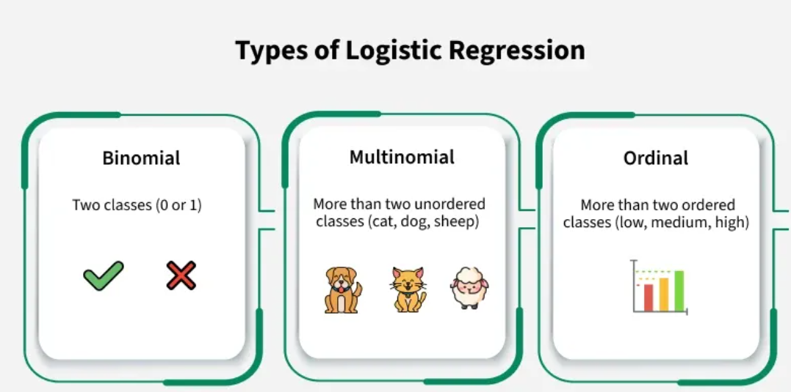
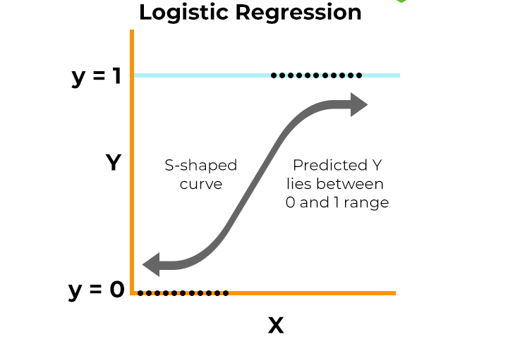

# Module 2: Logistic Regression

## 1. What is Logistic Regression?

Logistic Regression is a **supervised learning** algorithm used for **classification** tasks. It predicts the probability that an input belongs to a particular class (e.g., yes/no, 0/1). Instead of fitting a straight line, it fits an S-shaped curve (the logistic function) to model the probability.

## 2. Types of Logistic Regression

There are several types, each suited for different scenarios:

#### a. Simple Logistic Regression
Uses a **single input feature** to predict a binary outcome.
- **Key Formula:** `P(Y=1) = sigmoid(b0 + b1*X)`
- **Use Case:** Predicting if a user will buy a product based only on their age.

#### b. Multiple Logistic Regression
Uses **two or more input features** for prediction.
- **Key Formula:** `P(Y=1) = sigmoid(b0 + b1*X1 + b2*X2 + ...)`
- **Use Case:** Predicting purchase based on age, gender, and salary.

#### c. Polynomial Logistic Regression
Models **non-linear relationships** by transforming features into polynomial terms.
- **Key Formula:** `P(Y=1) = sigmoid(b0 + b1*X + b2*X² + ...)`
- **Use Case:** When the decision boundary between classes is curved, not straight.

## 3. Core Assumptions

- **Independence:** Observations are independent.
- **Linearity (in log-odds):** The log-odds of the outcome are a linear combination of the input features.
- **No or little multicollinearity:** Features should not be highly correlated.

## 4. Pros and Cons

#### Pros:
* **Simple & Fast:** Easy to implement and efficient for binary classification.
* **Probabilistic Output:** Gives probability estimates for predictions.
* **Interpretable:** Coefficients show the effect of each feature.

#### Cons:
* **Not for Nonlinear Problems:** Struggles with complex, highly non-linear relationships (unless using polynomial features).
* **Sensitive to Outliers:** Outliers can affect the model.

## 5. Interview Questions to Prepare

1. **What is the main difference between Linear and Logistic Regression?**
   > *Linear regression predicts continuous values; logistic regression predicts probabilities for classification.*

2. **What does the sigmoid function do in logistic regression?**
   > *It squashes any real-valued number into a value between 0 and 1, representing probability.*

3. **How do you interpret the coefficients in logistic regression?**
   > *Each coefficient represents the change in the log-odds of the outcome for a one-unit increase in the feature, holding others constant.*

4. **What is the decision boundary in logistic regression?**
   > *It’s the threshold (often 0.5) where the predicted probability switches from one class to another.*

---

*Example dataset: Social_Network_Ads.csv (predicting if a user purchased based on age, gender, and salary).*

