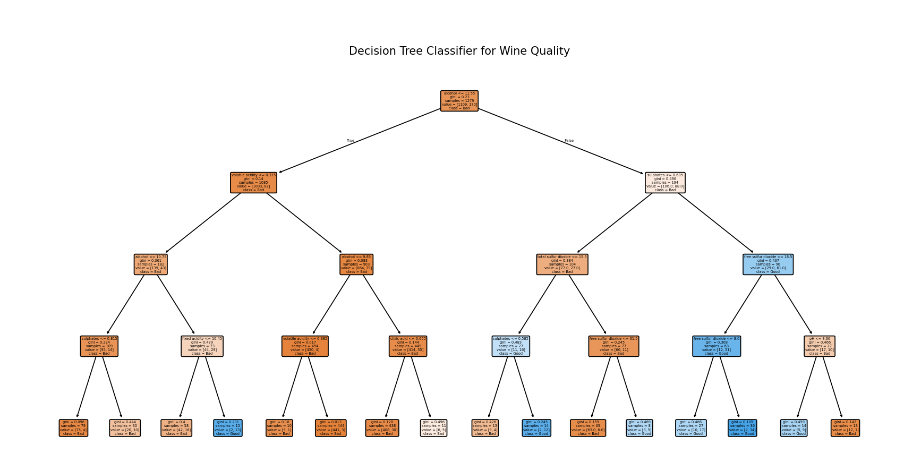
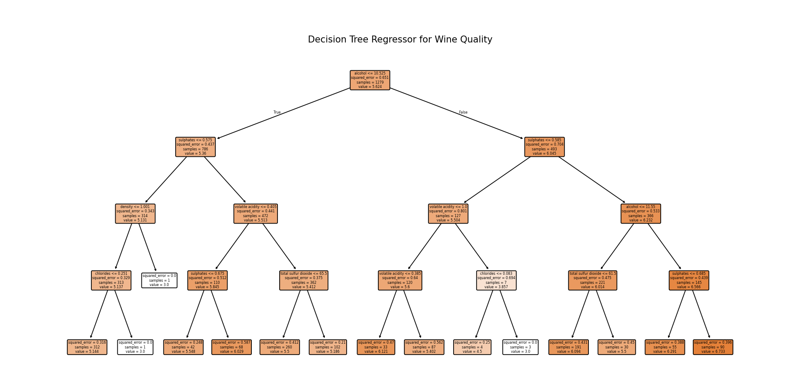
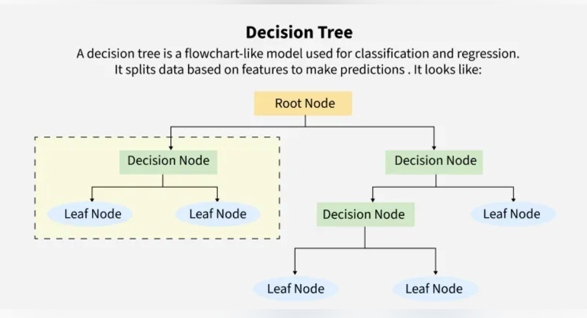

# Module 3: Decision Tree

## 1. What is a Decision Tree?

A Decision Tree is a **supervised learning** algorithm used for both **classification** and **regression** tasks. It splits data into branches based on feature values, forming a tree-like structure. Each internal node is a decision on a feature, each branch is an outcome, and each leaf node is a prediction.

## 2. Types of Decision Trees

- **Classification Tree:** Target variable is categorical (e.g., yes/no).
- **Regression Tree:** Target variable is continuous (e.g., price).

## 3. How Does a Decision Tree Work?

At each node, the algorithm chooses the feature and threshold that best splits the data, using a metric to measure "purity" or "homogeneity" of the resulting groups. This process repeats recursively until stopping criteria are met (like max depth or minimum samples per leaf).

## 4. Key Metrics Used in Decision Trees

### For Classification:
- **Gini Impurity:** Measures how often a randomly chosen element would be incorrectly labeled. Lower is better (0 is pure).
- **Entropy (Information Gain):** Measures the disorder or unpredictability. Lower entropy means more pure nodes. Information gain is the reduction in entropy after a split.

### For Regression:
- **Mean Squared Error (MSE):** Measures the average squared difference between actual and predicted values. Lower MSE means better splits.
- **Mean Absolute Error (MAE):** Measures the average absolute difference between actual and predicted values.

## 5. Pros and Cons

**Pros:**
- Easy to understand and visualize.
- No need for feature scaling.
- Handles both numerical and categorical data.
- Captures nonlinear relationships.

**Cons:**
- Prone to overfitting (especially deep trees).
- Unstable to small data changes.
- Less accurate than ensembles (like Random Forests).

## 6. Key Terms

- **Root Node:** The top node where the first split occurs.
- **Leaf Node:** The terminal node that gives the prediction.
- **Branch:** A split in the tree.
- **Depth:** The longest path from root to a leaf.

## 7. Interview Questions to Prepare

1. **How does a decision tree decide where to split?**
   > By choosing the split that results in the greatest reduction in impurity (Gini, entropy, or MSE).

2. **What is overfitting in decision trees and how can you prevent it?**
   > Overfitting is when the tree is too complex and fits noise. Prevent it by limiting depth, setting min samples per leaf, or pruning.

3. **What is pruning?**
   > Pruning removes sections of the tree that provide little value, reducing overfitting.

4. **When would you use a regression tree vs. a classification tree?**
   > Use regression trees for continuous targets, classification trees for categorical targets.

---

*Example use cases: customer churn prediction, loan approval, medical diagnosis.*

# Results from implementation.py

