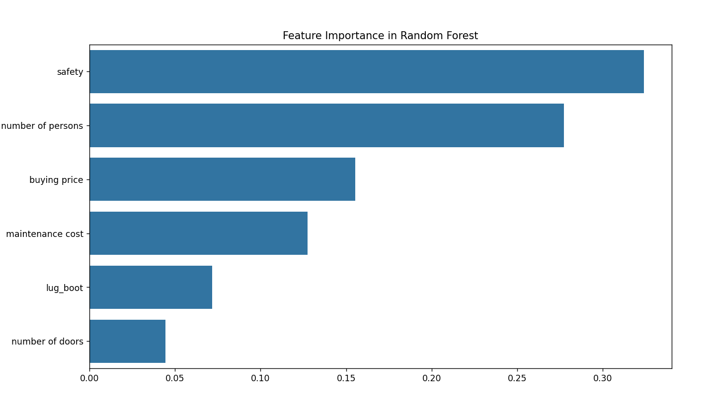
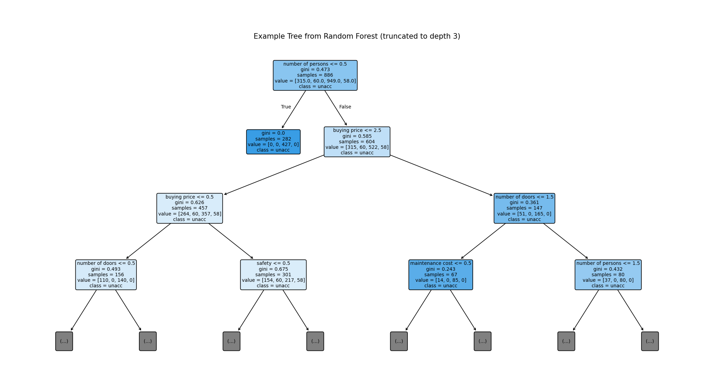
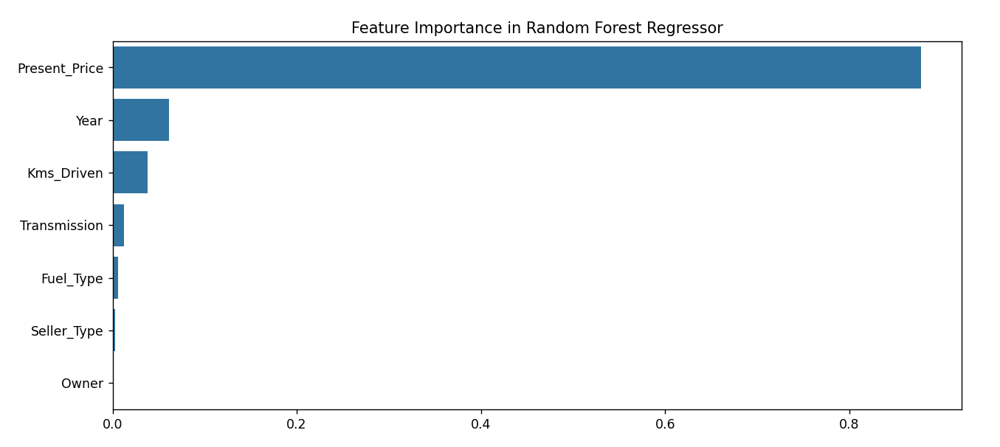
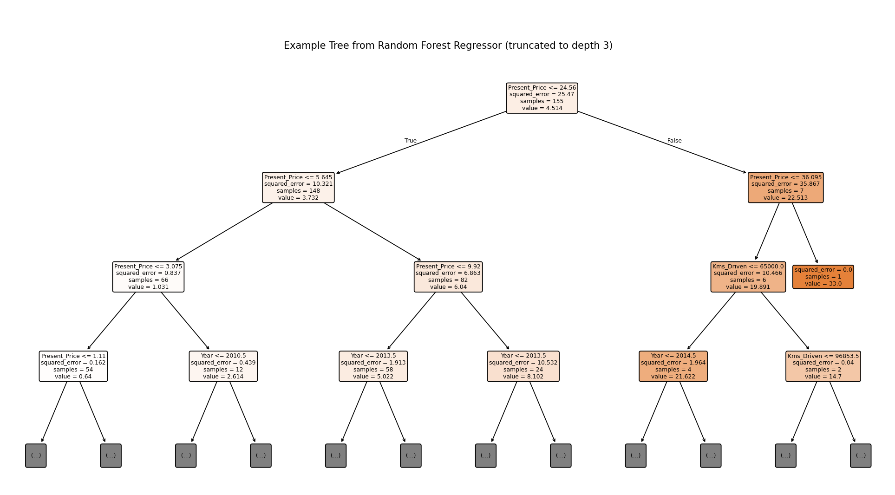

# Module 4: Random Forest

## 1. What is a Random Forest?

Random Forest is a powerful **ensemble learning** algorithm used for both **classification** and **regression** tasks. It builds a "forest" of many decision trees and combines their predictions to improve accuracy and control overfitting. Each tree is trained on a random subset of the data and features, making the forest robust and less prone to noise.

## 2. How Does Random Forest Work?

- **Bootstrap Aggregation (Bagging):** Each tree is trained on a random sample (with replacement) of the data.
- **Random Feature Selection:** At each split, a random subset of features is considered, making each tree unique.
- **Ensemble Prediction:** For classification, the forest predicts the class with the most votes (majority voting). For regression, it averages the predictions of all trees.

## 3. Why Use Random Forest?

- **Reduces Overfitting:** By averaging multiple trees, random forest reduces the risk of overfitting that single decision trees face.
- **Handles High-Dimensional Data:** Works well even when there are many features.
- **Robust to Outliers and Noise:** Randomness and averaging make it stable.

## 4. Key Metrics Used in Random Forest

### For Classification:
- **Accuracy:** Proportion of correct predictions.
- **Confusion Matrix:** Shows true vs. predicted classes.
- **Precision, Recall, F1-Score:** Evaluate performance for each class.
- **Feature Importance:** Shows which features are most useful for prediction.

### For Regression:
- **Mean Squared Error (MSE):** Average squared difference between actual and predicted values.
- **Mean Absolute Error (MAE):** Average absolute difference.
- **R² Score:** Proportion of variance explained by the model.

## 5. Pros and Cons

**Pros:**
- High accuracy and generalization.
- Handles both numerical and categorical features.
- Reduces overfitting compared to single trees.
- Provides feature importance.
- Works well with missing data.

**Cons:**
- Less interpretable than a single decision tree.
- Can be slower and more memory-intensive.
- May not perform well on very sparse data.

## 6. Key Terms

- **Ensemble:** A group of models whose predictions are combined.
- **Bagging:** Training each tree on a random sample of the data.
- **Majority Voting:** For classification, the class chosen by most trees.
- **Feature Importance:** A score indicating how useful each feature was in the forest.

## 7. Interview Questions to Prepare

1. **How does random forest reduce overfitting compared to a single decision tree?**
   > By averaging the predictions of many trees, each trained on different data and features, it smooths out noise and variance.

2. **What is the difference between bagging and boosting?**
   > Bagging builds trees independently in parallel (like random forest), while boosting builds trees sequentially, each focusing on the errors of the previous.

3. **How do you interpret feature importance in random forest?**
   > Features that are used more often for splitting and reduce impurity more are considered more important.

4. **What are the main hyperparameters in random forest?**
   > Number of trees (`n_estimators`), maximum tree depth (`max_depth`), number of features considered at each split (`max_features`), and minimum samples per leaf (`min_samples_leaf`).

5. **When might random forest not be the best choice?**
   > When interpretability is crucial, or for very high-dimensional sparse data (like text).

---

*Example use cases: credit scoring, medical diagnosis, fraud detection, customer churn prediction, and more.*

# Results from implementation_classifier.py

# Results from implementation_regressor.py

