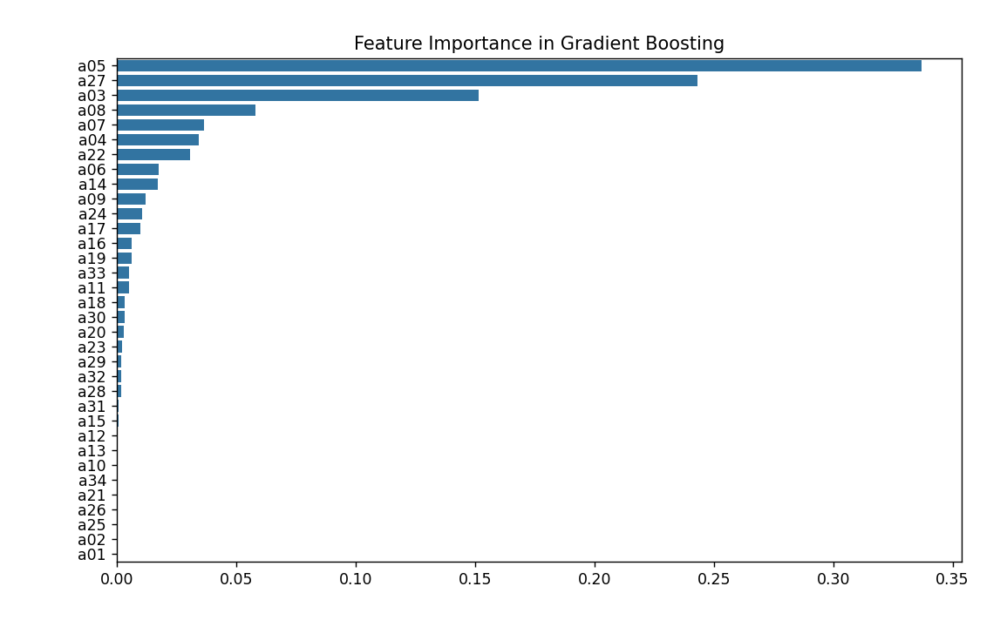

# Module 5: Gradient Boosting

## 1. What is Gradient Boosting?

Gradient Boosting is a powerful **ensemble learning** technique used for both **classification** and **regression** tasks. It builds a strong predictive model by combining many weak learners (typically shallow decision trees), where each new tree corrects the errors of the previous ones. The model is built in a stage-wise fashion, optimizing a loss function using gradient descent.

## 2. How Does Gradient Boosting Work?

- **Sequential Learning:** Trees are added one at a time, and each new tree focuses on the residual errors (the difference between the actual and predicted values) of the combined previous trees.
- **Gradient Descent:** The algorithm minimizes a loss function (e.g., mean squared error for regression, log loss for classification) by moving in the direction of the negative gradient.
- **Weighted Ensemble:** Each tree’s prediction is weighted and added to the ensemble, gradually improving the model.

## 3. Why Use Gradient Boosting?

- **High Predictive Power:** Often achieves better accuracy than single models or bagging methods.
- **Flexibility:** Can optimize different loss functions and handle various data types.
- **Feature Importance:** Provides insight into which features are most influential.

## 4. Key Metrics Used in Gradient Boosting

### For Classification:
- **Accuracy:** Proportion of correct predictions.
- **Confusion Matrix:** Shows true vs. predicted classes.
- **Precision, Recall, F1-Score:** Evaluate performance for each class.
- **Log Loss:** Measures the uncertainty of predictions.

### For Regression:
- **Mean Squared Error (MSE):** Average squared difference between actual and predicted values.
- **Mean Absolute Error (MAE):** Average absolute difference.
- **R² Score:** Proportion of variance explained by the model.

## 5. Pros and Cons

**Pros:**
- High accuracy and generalization.
- Handles both numerical and categorical features.
- Can model complex, nonlinear relationships.
- Robust to outliers (with proper tuning).

**Cons:**
- Can overfit if not properly regularized.
- More computationally intensive and slower to train than Random Forests.
- Sensitive to hyperparameters (learning rate, number of trees, tree depth).
- Less interpretable than single trees.

## 6. Key Terms

- **Weak Learner:** A simple model (usually a shallow tree) that performs slightly better than random guessing.
- **Learning Rate:** Controls how much each tree contributes to the final prediction.
- **Number of Estimators:** The number of trees in the ensemble.
- **Loss Function:** The function the algorithm tries to minimize (e.g., MSE, log loss).

## 7. Interview Questions to Prepare

1. **How does gradient boosting differ from random forest?**
   > Random forest builds trees independently in parallel (bagging), while gradient boosting builds trees sequentially, each correcting the previous (boosting).

2. **What is the role of the learning rate in gradient boosting?**
   > It controls how much each new tree influences the overall model; lower values require more trees but can improve generalization.

3. **How do you prevent overfitting in gradient boosting?**
   > Use techniques like early stopping, limiting tree depth, reducing the learning rate, and using regularization parameters.

4. **What are some popular implementations of gradient boosting?**
   > XGBoost, LightGBM, CatBoost, and scikit-learn’s GradientBoostingClassifier/Regressor.

---

*Example use cases: ranking, credit scoring, customer churn prediction, click-through rate prediction, and more.*

# Results from implementation.py
